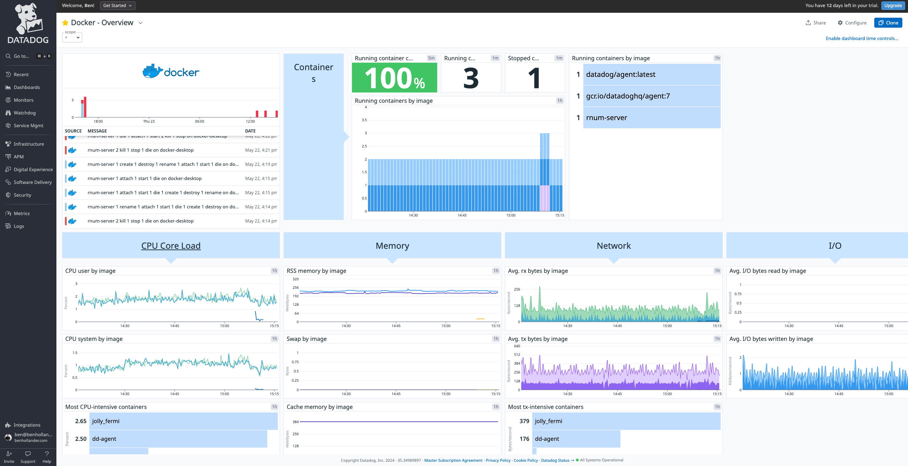

# rnum

A REST API that accepts an integer as input, and returns the number in Roman Numeral format[^1]

## Examples
### Single integer
```sh
curl "http://localhost:3000/romannumeral?query=3" #output: {"input":"3","output":"III"}
```
### Range
```sh
curl "http://localhost:3000/romannumeral?min=3&max=6" #output: {"conversions":[{"input":3,"output":"III"},{"input":4,"output":"IV"},{"input":5,"output":"V"},{"input":6,"output":"VI"}]}
```
### Both single integer and range
```sh
curl "http://localhost:3000/romannumeral?min=3&max=6&query=2024" #output: {"conversions":[{"input":3,"output":"III"},{"input":4,"output":"IV"},{"input":5,"output":"V"},{"input":6,"output":"VI"}],"input":2024,"output":"MMXXIV"}
```
_Supports integers 1-3999_


## Development

### Running in development mode
Automatically refreshes server on save for faster development
```sh
npm ci
npm run dev
```

### Running in Docker
This can also be run in production mode from a [Docker](https://www.docker.com/) container
```sh
npm run start # shortcut/alias for `docker compose up --build`
```

### Available npm commands
* `build`: generates a production build in `./build`
* `dev`: runs the server in watch mode for faster development
* `generate-license-report`: Regenerate DEPENDENCIES.md file
* `lint`: runs linter for all typescript files
* `prepare`: used by [husky](https://typicode.github.io/husky/) for precommit scripts
* `start`: runs in a docker container
* `test`: runs jest unit test suite
* `test:watch`: runs unit tests in watch mode for faster development

### Project structure
This typescript project utilizes [koa](https://github.com/koajs/koa) HTTP middleware framework for node.js, along with Jest for testing, and eslint for code standardization.
```bash
├── Dockerfile
├── README.md
├── compose.yaml
├── docs
│   ├── DEPENDENCIES.md
│   └── datadog_dashboard.png
├── eslint.config.mjs
├── jest.config.ts
├── package-lock.json
├── package.json
├── src
│   ├── constants.ts # central place for constants
│   ├── index.ts # entry point for the app
│   ├── middleware.spec.ts # unit tests for middleware
│   ├── middleware.ts # middleware for data validation and generating API return results
│   ├── tracer.ts # datadog APM tracing initialization
│   ├── utils.spec.ts # unit tests for utils
│   └── utils.ts # all functions used to calcuate roman numerals
└── tsconfig.json
```
### Logging
This project uses [winston](https://github.com/winstonjs/winston) for logging.
Running app logs are stored in the `./logs` directory and also sent to datadog (if datadog agent is set up locally).
#### Example
```typescript
import { getLogger } from "./logger";
const logger = getLogger();

// log info
logger.info('I am an info-level log.');

// some code that could throw an error
try {
    throw new Error('example error');
} catch(e) {
    // log error
    logger.error('exception', {
        error: {
            message: e.message,
            stack: e.stack
        }
    });
};
```

### Dependencies
[DEPENDENCIES.md](docs/DEPENDENCIES.md) contains a report of all dependencies and their license data.
 
### Monitoring
Resource monitoring is available through datadog, along with APM if [configured](https://docs.datadoghq.com/containers/docker/?tab=standard#setup) and deployed with your API key


## Future considerations
* Set up CI/CD deployment
  * Set up push on green workflow
  * Use environment variables for datadog API keys
* Instrument logging/datadog further
  * differentiate between enviornments, monitor success metrics, set up error alerting, etc
  * Remove requirement for [local datadog agent](https://docs.datadoghq.com/logs/log_collection/nodejs/?tab=winston30#agentless-logging), or make the agent portable
* Improve scalability - eg. Rate limiting to prevent DDoS attacks

[^1]: Following the 'Standard form' outlined  at https://en.wikipedia.org/wiki/Roman_numerals
    | Integer | Thousands | Hundreds | Tens | Units |
    |---------|-----------|----------|------|-------|
    | 1       | M         | C        | X    | I     |
    | 2       | MM        | CC       | XX   | II    |
    | 3       | MMM       | CCC      | XXX  | III   |
    | 4       |           | CD       | XL   | IV    |
    | 5       |           | D        | L    | V     |
    | 6       |           | DC       | LX   | VI    |
    | 7       |           | DCC      | LXX  | VII   |
    | 8       |           | DCCC     | LXXX | VIII  |
    | 9       |           | CM       | XC   | IX    |